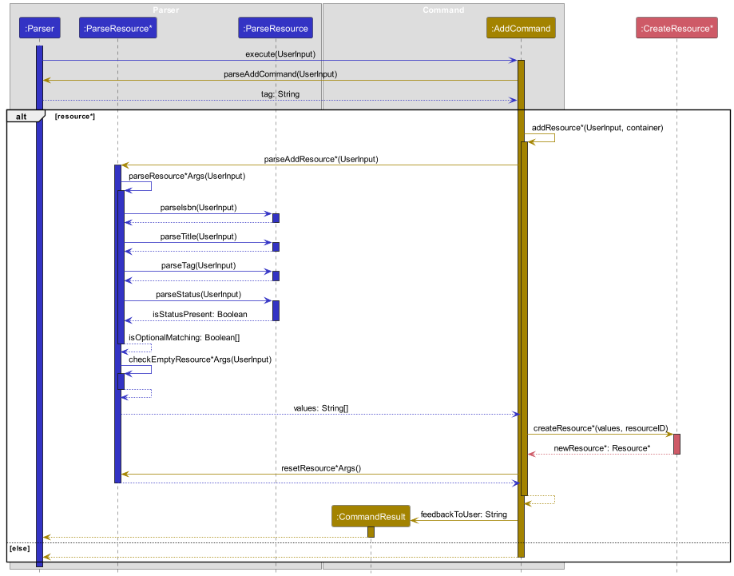

# Developer Guide

## Acknowledgements

{list here sources of all reused/adapted ideas, code, documentation, and third-party libraries -- include links to the original source as well}

## Setting Up & Getting Started

1. Fork the repo at https://github.com/AY2324S1-CS2113T-W11-1/tp.
2. Clone the fork into your computer.

## Design & Implementation

{Describe the design and implementation of the product. Use UML diagrams and short code snippets where applicable.}

### Architecture


**Main components of SysLib Architecture**

SysLib currently consists of four main components:

- `UI`: User Interaction
- `Parser`: Parsing User Response 
- `Command`: Command Executor
- `Data`: Holds the data of SysLib


   
### UI Component

### Parser Component

### Command Component


### Data Component

## Implementation 
This section provides details on how certain features are implemented. 

### Find Resource Feature

The `find` command allows users to search for resources based on specified filters such as author (`/a`), ISBN (`/i`), ID (`/id`), and title (`/t`). The results will show all resources that match any of the given filters.

`find` has the following options:
- `find /id [ID]`
- `find /t [TITLE]`
- `find /a [AUTHOR]`
- `find /i [ISBN]`

Multiple filters can also be combined:

- `find /t [TITLE] /a [AUTHOR]`

#### Implementation

Upon receiving the `find` command, the system will:

1. Parse the filters and their associated values.
2. Filter the resources based on the given filters.
3. Display the matching resources.

#### Example Usage Scenario

**Step 1.** The user inputs the command: `find /a "F. Scott Fitzgerald"`

**Step 2.** The `UI` component forwards the input to `SYSLIB`, which then sends it to the `PARSER`.

**Step 3.** The `PARSER` processes the command, extracts the `author` filter, and retrieves all resources written by "F. Scott Fitzgerald".

**Step 4.** The matching resources are displayed to the user.

#### Sequence Diagram
A sequence diagram could be provided here to visually show how the `find` function works.

(Note: You would include the actual sequence diagram image, similar to the diagrams shown for other features.)

### Examples for Testing

1. **Find by Author**
    - Test case: `find /a "F. Scott Fitzgerald"`

      Expected: All resources written by F. Scott Fitzgerald are displayed.

2. **Find by ISBN**
    - Test case: `find /i "9780061120084"`

      Expected: The resource with ISBN "9780061120084" is displayed, which should be "To Kill a Mockingbird" by Harper Lee.

3. **Find by ID**
    - Test case: `find /id 2`

      Expected: The resource with ID "2" is displayed, which should be "To Kill a Mockingbird" by Harper Lee.

4. **Find by Title**
    - Test case: `find /t "The Great Gatsby"`

      Expected: The resource titled "The Great Gatsby" is displayed.

5. **Combining Filters**
    - Test case: `find /a "F. Scott Fitzgerald" /t "The Great Gatsby"`

      Expected: Only the resource that matches both the title "The Great Gatsby" and the author "F. Scott Fitzgerald" is displayed.


### Add Resource Feature

The `add` feature is responsible for processing user commands to add a new book to SysLib. It is facilitated by 
the `AddCommand` component. It works with `Parser` and `Command` components to parse and validate the user input. 
The new book is stored internally in `resourceList` as a `Book`. 

`add` has seven options:
- add /id [id] /t [title] /a [author] /tag [tag] /i [isbn]
- add /id [id] /t [title] /a [author] /tag [tag] /i [isbn] _/g [genre] /s [status]_

#### Implementation

It implements the following operations:

- `ADDCOMMAND#parseArgument(statement: String)` -- Parses the input command to extract relevant information.
- `ADDCOMMAND#validate(statement: String, values: String[])` -- Validates the input statement to ensure that it is valid.
- `ADDCOMMAND#createBook(values: String[])` -- Creates a new book based on the parsed and validated values.

#### Example Usage Scenario

Step 1. The user inputs the command: `add /id 0005 /t Frankenstein /a Mary Shelley /i FKS0001 /tag B /g Gothic, Fiction`

Step 2. The `UI` component forwards the input to `SYSLIB`, which in turn passes it to the `PARSER`.

Step 3. The `PARSER` processes the command and determines that it contains a valid key (`add`). It then calls 
`ADDCOMMAND#execute(statement: String, this: Parser)` with the input command.

Step 4. The `ADDCOMMMAND` component receives the command and performs the following operations:
- Calls `ADDCOMMAND#parseArgument(statement: String)` to extract values for ID, title, author, ISBN, tag, and genres.
- Calls `ADDCOMMAND#validate(statement: String, values: String[])` to ensure the validity of the input command.

Step 5. The `COMMAND` component processes the input command to ensure that it meets the required format and constraints.
It prepares the argument values for further processing.

Step 6. Since the `tag` argument in the input command indicates that it is a book, the `ADDCOMMAND` determines that the
key is equal to `b` (ignoring case). It then creates a new `Book` object using the parsed values (title, ISBN, author, 
genres, ID).

Step 7. The newly created book is forwarded to the `PARSER` to be added to the `resourceList`.

#### Sequence Diagram
The following sequence diagram shows how the add function works:


### Listing Resources Feature

The `list` command works with the `Parser` and `Command` component to execute the correct action. 

`list` has four options:
- list
- list _/tag [tag]_
- list _/g [genre]_
- list _/tag [tag]_ _/g [genre]_

When `list` is specified with both `tag` and `genre` filters, it is `AND` inclusive, listing only 
Resources with the same tag and genre. 

Sequence Diagram:


When a user enters `list /tag B`, the Parser retrieves the parameters from the input and
calls the `execute` function of ListCommand.

ListCommand then calls `parseArg` and `validate` from `Command`, which checks if the parameters are valid. If it passes
the checks, `filterResources` is called to begin the filtering process. First it calls `hasFilters()` check if the user 
selected any filters `[tag/genre/both]` or none. 

If hasFilters returns `true`, it filters the `resourceList` with the given keywords and display the details 
of the resources.

If hasFilters returns `false`, it skips the filtering process and displays the details of all the resources.

## Product scope

### Target user profile

All librarians, not just system librarian!

- Needs to manage inventory with significant number of resources e.g. books
- Is a fast typist

### Value Proposition

To provide a platform to help librarians to quickly find the information they need to assist patrons.

## User Stories

| Version | As a ...  | I want to ...                                                                              | So that I can ...                                                              |
|---------|-----------|--------------------------------------------------------------------------------------------|--------------------------------------------------------------------------------|
| v1.0    | librarian | view a list of books that the library has                                                  | have an overview of all the books                                              |
| v1.0    | librarian | add new books to our inventory by entering their title, author, ISBN, and publication year | keep our collection up-to-date                                                 |
| v1.0    | librarian | delete books from the database                                                             | let the patrons know our library no longer carries it                          |
| v1.0    | librarian | tag a book as physical medium like newspapers, audio cds, books or online like eJournals   | patrons can know what type are available                                       |
| v1.0    | librarian | have a help function                                                                       | know the commands of this programme                                            |
| v1.0    | librarian | quickly find out how many books we have of a particular author and the names of the books  | know how many books are related to the author                                  |
| v2.0    | librarian | import/export our library's inventory data to a file format                                | easily share with other libraries to be used for backup and archival purposes. |
| v2.0    | librarian | find a to-do item by name                                                                  | locate a to-do without having to go through the entire list                    |
| v2.0    | librarian | get the status of an item                                                                  | know if it is available                                                        |
| v2.0    | librarian | update the details of a resource                                                           | fix any mistakes and maintain consistency                                      |
| v2.0    | librarian | add in different types of resources                                                        | differentiate between resources such as magazines, cds...                      |

## Use Cases

(For all use cases below, the System is the SysLib and the Actor is the user, unless specified otherwise)

### Use case: Add a book

#### MSS
1. User requests to add a book
2. AddressBook adds the book

    Use case ends.

#### Extensions
- 1a. The given ID is invalid.
  - 1a1. SysLib shows an error message.
    
    Use case ends.
  
- 1b. Insufficient data given.
  - 1b1. SysLib shows an error message.

    Use case ends.

## Non-Functional Requirements

{Give non-functional requirements}

## Glossary

* *glossary item* - Definition

## Instructions for Manual Testing
Example input:
```
help
```
Example response:
```
Commands available:
add: adds a new resource to the library inventory.(e.g. add /id ID /t TITLE /a AUTHOR /tag TAG /i ISBN [/g GENRE])
delete: deletes the resource with the specified ID from the library inventory. (e.g. delete /id 123456789)
list: list all resources OR filter by certain tags or genre.(e.g. list /tag B /g Fiction
find: find a resource by title, author, ISBN or given id. (e.g. find /i 9780763630188)
edit: Edit a listing by entering its isbn to update its details. (e.g. edit /i 123 /t NEW_TITLE /a NEW_AUTHOR)
exit: displays a farewell message and exits the program (e.g. exit)
For more information, please refer to our user guide at:https://ay2324s1-cs2113t-w11-1.github.io/tp/UserGuide.html
____________________________________________________________
```
Example input:

```
add /id 1 /t The Great Gatsby /a F. Scott Fitzgerald /tag B /i 9780023381201 /g Novel, Fiction, Tragedy /s lost
```
Example response:
```
This book is added: The Great Gatsby
____________________________________________________________
```
Example input:
```
add /id 2 /t To Kill a Mockingbird /a Harper Lee /tag B /i 9780061120084 /g Novel, Bildungsroman, Southern Gothic, Domestic Fiction, Thriller, Legal Story
```
Example response:
```
This book is added: To Kill a Mockingbird
____________________________________________________________
```
Example input:
```
list
```
Example response:
```
Listing all resources in the Library:

1. [B]  ID: 1 Title: The Great Gatsby ISBN: 9780023381201 Author: F. Scott Fitzgerald Genre: Novel, Fiction, Tragedy Status: LOST
2. [B]  ID: 2 Title: To Kill a Mockingbird ISBN: 9780061120084 Author: Harper Lee Genre: Novel, Bildungsroman, Southern Gothic Status: AVAILABLE

There are currently 2 resource(s).
____________________________________________________________
```
Example input:
```
delete /id 1
```
Example response:
```
Looking for ID: 1...
This resource is removed: 
[B]  ID: 1 Title: The Great Gatsby ISBN: 9780023381201 Author: F. Scott Fitzgerald Genre: Novel, Fiction, Tragedy Status: LOST
____________________________________________________________
```
Example input:
```
exit
```
Example response:
```
Bye, hope to see you again soon!
____________________________________________________________
```
### Launch and Shutdown

1. Initial launch
   1. Download the jar file and copy it into an empty folder.
   2. Open the command prompt and run `java -jar SysLib.jar`.


### Adding a Book
1. Add a book
   1. Test case: `add /id 0005 /t Frankenstein /a Mary Shelley /i FKS0001 /tag B`

       Expected: A book with ID: 0005, Title: Frankenstein, Author: Mary Shelley, and ISBN: FKS0001 is created and added 
       into the list. A message is shown to acknowledge that the book has been added successfully.
   
   2. Test case: `add /id 0005 /t Frankenstein /a Mary Shelley /i FKS0001 /tag B /g Gothic, Fiction`

       Expected: A book with ID: 0005, Title: Frankenstein, Author: Mary Shelley, ISBN: FKS0001, and 
       Genres: Gothic, Fiction is created and added into the list. A message is shown to acknowledge that the book 
       has been added successfully.
   
   3. Test case: `add /id abcd /t Frankenstein /a Mary Shelley /i FKS0001 /tag B /g Gothic, Fiction`
        
       Expected: No book is added. An error message is shown to indicate that the id is invalid.

   4. Test case: `add /id 0005 /t Frankenstein /a Mary Shelley /i FKS0001 /tag A /g Gothic, Fiction`

      Expected: No book is added. An error message is shown to indicate that the tag is invalid.

   5. Test case: `add /id 0005 /t Frankenstein`
   
      Expected: No book is added. An error message is shown to indicate that the input is incomplete.