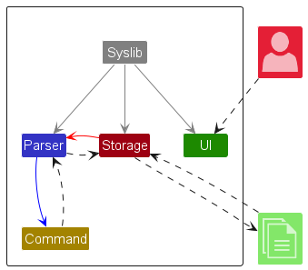
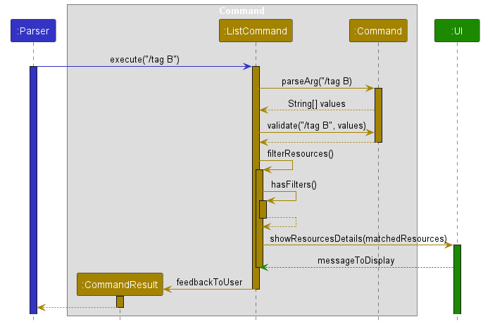

# Developer Guide

## Acknowledgements

{list here sources of all reused/adapted ideas, code, documentation, and third-party libraries -- include links to the original source as well}

## Design & implementation

{Describe the design and implementation of the product. Use UML diagrams and short code snippets where applicable.}

### Architecture

**Main components of SysLib Architecture**

SysLib currently consists of four main components:

- `UI`: User Interaction
- `Parser`: Parsing User Response 
- `Command`: Command Executor
- `Data`: Holds the data of SysLib

   
### UI Component

### Parser Component

### Command Component

### Data Component

## Implementation 

### Listing Resources Feature

The `list` command works with the `Parser` and `Command` component to execute the correct action. 

`list` has four options:
- list
- list _/tag [tag]_
- list _/g [genre]_
- list _/tag [tag]_ _/g [genre]_

When `list` is specified with both `tag` and `genre` filters, it is `AND` inclusive, listing only 
Resources with the same tag and genre. 

Sequence Diagram:

## Product scope

### Target user profile

All librarians, not just system librarian!

### Value proposition

To provide a platform to help librarians to quickly find the information they need to assist patrons.

## User Stories

|Version| As a ...  | I want to ...                                                                              | So that I can ...                                           |
|--------|-----------|--------------------------------------------------------------------------------------------|-------------------------------------------------------------|
|v1.0| librarian | view a list of books that the library has                                                  | have an overview of all the books                           |
|v1.0| librarian | add new books to our inventory by entering their title, author, ISBN, and publication year | keep our collection up-to-date                              |
|v1.0| librarian | delete books from the database                                                             | let the patrons know our library no longer carries it       |
|v1.0| librarian | tag a book as physical medium like newspapers, audio cds, books or online like eJournals   | patrons can know what type are available                    |
|v1.0| librarian | have a help function                                                                       | know the commands of this programme                         |
|v1.0| librarian | quickly find out how many books we have of a particular author and the names of the books  | know how many books are related to the author               |
|v2.0| user      | find a to-do item by name                                                                  | locate a to-do without having to go through the entire list |

## Non-Functional Requirements

{Give non-functional requirements}

## Glossary

* *glossary item* - Definition

## Instructions for manual testing

{Give instructions on how to do a manual product testing e.g., how to load sample data to be used for testing}
