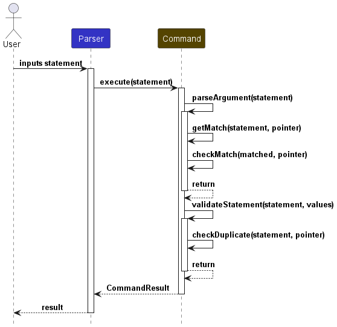
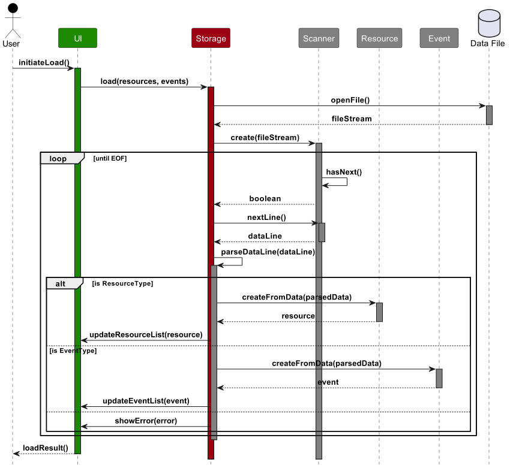
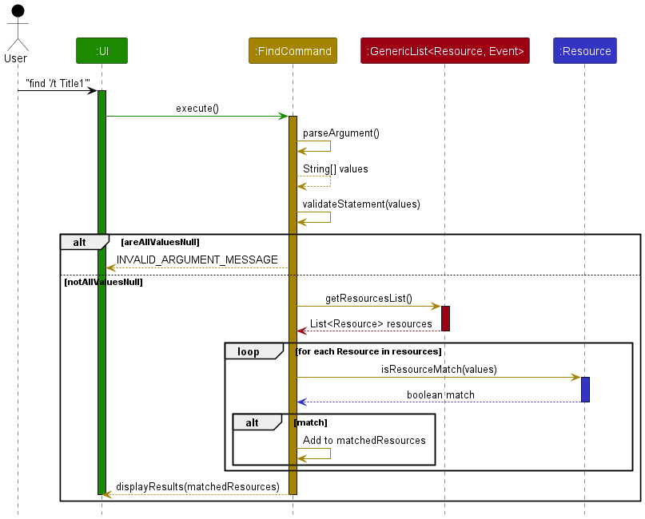
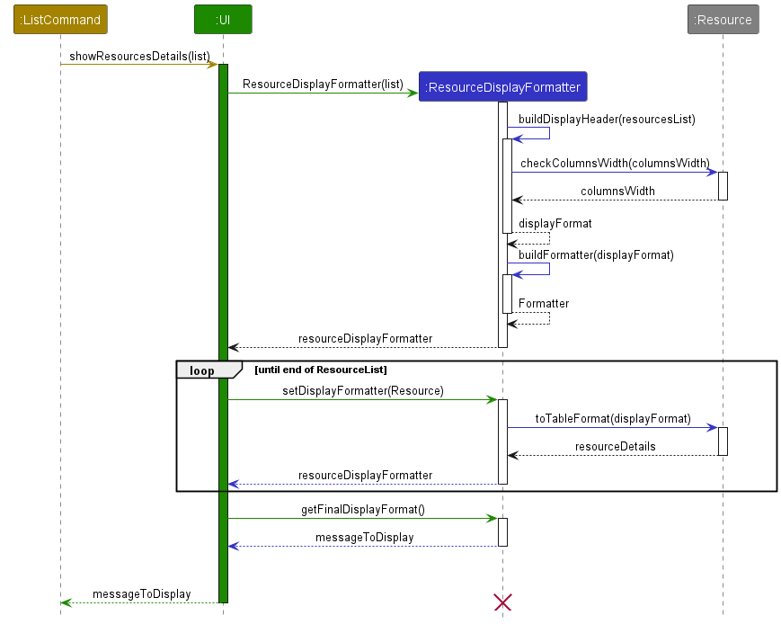
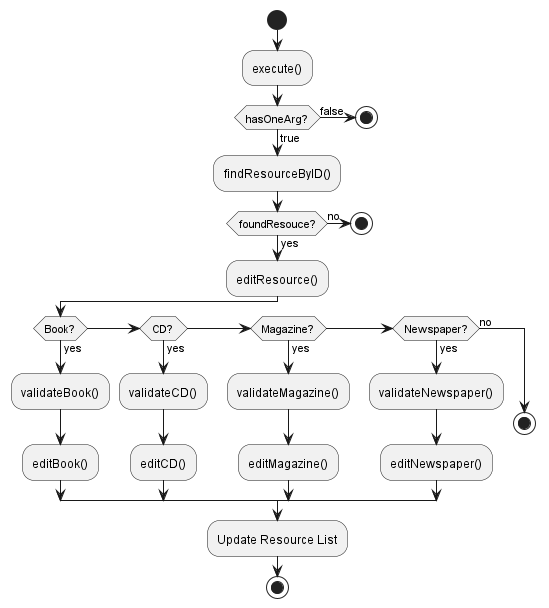
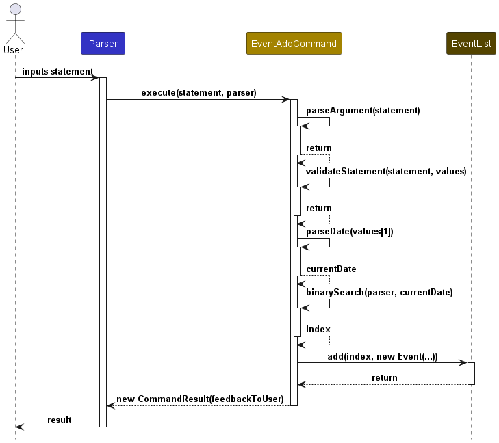

# Developer Guide

## Acknowledgements

{list here sources of all reused/adapted ideas, code, documentation, and third-party libraries -- include links to the original source as well}

## Setting Up & Getting Started

1. Fork the repo at https://github.com/AY2324S1-CS2113T-W11-1/tp.
2. Clone the fork into your computer.

## Design & Implementation

{Describe the design and implementation of the product. Use UML diagrams and short code snippets where applicable.}

### Architecture


**Main components of SysLib Architecture**

SysLib currently consists of five main components:

- `UI`: User Interaction
- `Parser`: Parsing User Response 
- `Command`: Command Executor
- `Data`: Holds the data of SysLib in memory such as the Resource List
- `Storage`: Loads data from file in hard disk, and saves data to hard disk on program exit

**How the architecture components interact with each other**


   
### UI Component

The UI Component consists of methods to print messages to the user as output. 

### Parser Component

The parsing for a generic command can be seen here:


For some commands that does not require arguments (etc: help, exit), parseArgument
and validateStatement will not be called

For more details on each Command check them out below
### Command Component


### Data Component

The `Data` Component is implemented using the `GenericList` which acts as a container for 2 List's of types `Resource` and `Event`.
When starting the program, the GenericList will be loaded with data from the storage file. On exit, the data from the GenericList will be saved back into the storage file.

### Storage Component

The storage component saves all resources and events in GenericList on exit. On start, it also loads currently saved resources and events in storage.txt




## Implementation 
This section provides details on how certain features are implemented. 

### Find Resource Feature

The `find` command allows users to search for resources based on specified filters such as author (`/a`), ISBN (`/i`), ID (`/id`), and title (`/t`). The results will show all resources that match any of the given filters.

> For non-book resources, `author` refers to `publisher`,`creator` and `brand` for Newspapers, CD's and Magazines
> respectively.

`find` has the following options:
- `find /id [ID]`
- `find /t [TITLE]`
- `find /a [AUTHOR/PUBLISHER/BRAND/CREATOR]`
- `find /i [ISBN]`

Multiple filters can also be combined:

- `find /t [TITLE] /a [AUTHOR/PUBLISHER/BRAND/CREATOR]`

#### Implementation

Upon receiving the `find` command, the system will:

1. Parse the filters and their associated values.
2. Filter the resources based on the given filters.
3. Display the matching resources.

#### Example Usage Scenario

**Step 1.** The user inputs the command: `find /a "F. Scott Fitzgerald"`

**Step 2.** The `UI` component forwards the input to `SYSLIB`, which then sends it to the `PARSER`.

**Step 3.** The `PARSER` processes the command, extracts the `author` filter, and retrieves all resources written by "F. Scott Fitzgerald".

**Step 4.** The matching resources are displayed to the user.

#### Sequence Diagram



### Examples for Testing

1. **Find by Author**
    - Test case: `find /a "F. Scott Fitzgerald"`

      Expected: All resources written by F. Scott Fitzgerald are displayed.

2. **Find by ISBN**
    - Test case: `find /i "9780061120084"`

      Expected: The resource with ISBN "9780061120084" is displayed, which should be "To Kill a Mockingbird" by Harper Lee.

3. **Find by ID**
    - Test case: `find /id 2`

      Expected: The resource with ID "2" is displayed, which should be "To Kill a Mockingbird" by Harper Lee.

4. **Find by Title**
    - Test case: `find /t "The Great Gatsby"`

      Expected: The resource titled "The Great Gatsby" is displayed.

5. **Combining Filters**
    - Test case: `find /a "F. Scott Fitzgerald" /t "The Great Gatsby"`

      Expected: Resources that match both the title "The Great Gatsby" and the author "F. Scott Fitzgerald" are displayed.


### Add Resource Feature

The `add` feature is responsible for processing user commands to add a new resource to SysLib. It is facilitated by 
the `AddCommand` component. It works with `Parser` and `Command` components to parse and validate the user input. 
The new resource is stored internally in `resourceList` as a `Book`, `EBook`, `CD`, `Magazine`, `EMagazine`, `Newspaper`, 
or `ENewspaper` depending on the type of resources specified by `tag`. 

There are seven types of `Resource`:
- Book
- EBook
- CD
- Magazine
- EMagazine
- Newspaper
- ENewspaper

`add` has eighteen possible options:  

- **Book** has four options:
  - add /i [isbn] /t [title] /a [author] /tag [tag] 
  - add /i [isbn] /t [title] /a [author] /tag [tag] _/g [genre]_
  - add /i [isbn] /t [title] /a [author] /tag [tag] _/s [status]_
  - add /i [isbn] /t [title] /a [author] /tag [tag] _/g [genre] /s [status]_
- **EBook** has four options:
    - add /i [isbn] /t [title] /a [author] /tag [tag] /l [link]
    - add /i [isbn] /t [title] /a [author] /tag [tag] /l [link] _/g [genre]_
    - add /i [isbn] /t [title] /a [author] /tag [tag] /l [link] _/s [status]_
    - add /i [isbn] /t [title] /a [author] /tag [tag] /l [link] _/g [genre] /s [status]_
- **CD** has two options:
    - add /i [isbn] /t [title] /c [creator] /ty [type] /tag [tag]
    - add /i [isbn] /t [title] /c [creator] /ty [type] /tag [tag] _/s [status]_
- **Magazine** has two options:
    - add /i [isbn] /t [title] /b [brand] /is [issue] /tag [tag]
    - add /i [isbn] /t [title] /b [brand] /is [issue] /tag [tag] _/s [status]_
- **EMagazine** has two options:
    - add /i [isbn] /t [title] /b [brand] /is [issue] /tag [tag] /l [link]
    - add /i [isbn] /t [title] /b [brand] /is [issue] /tag [tag] /l [link] _/s [status]_
- **Newspaper** has two options:
    - add /i [isbn] /t [title] /p [publisher] /ed [edition] /tag [tag]
    - add /i [isbn] /t [title] /p [publisher] /ed [edition] /tag [tag] _/s [status]_
- **ENewspaper** has two options:
    - add /i [isbn] /t [title] /p [publisher] /ed [edition] /tag [tag] /l [link]
    - add /i [isbn] /t [title] /p [publisher] /ed [edition] /tag [tag] /l [link] _/s [status]_

#### Implementation

It implements the following operations:

- `AddCommand#execute(statement: String, container: GenericList<Resource, Event>)` -- Validates and adds the new resource into the resource list.
- `Parser#parseAddCommand(statement: String)` -- Parses the input command to extract the tag indicating the type of resource.
- `AddCommand#addResource*(statement: String, container: GenericList<Resource, Event>)` -- Adds a new resource to the resource list after validation.
- `ParserResource*#parseAddResource*(statement: String)` -- Parses the input command to ensure that it follows the right format for the particular resource.
- `CreateResource#createResource*(values: String[], resourceID: int)` -- Creates a new resource with the given information.
- `ParserResource*#parseResource*Args(statement: String)` -- Parses the input command to ensure that all attributes required by the particular resource are parsed.
- `ParserResource#parseAttribute*(statement: String)`-- Parses the input command to ensure that each attribute follows the right format.
- `ParserResource*#checkEmptyResource*Args(args: String[])` -- Parses the arguments to ensure that they are not empty.
- `ParserResource*#resetResource*Args()` - Clears the previous arguments to receive new arguments for new resource.

#### Example Usage Scenario

Step 1. The user inputs the command: `add /i 9783161484100 /t Crime and Punishment /a Dostoevsky /tag B /g Fiction /s lost`.

Step 2. The `Parser` processes the command and calls `AddCommand#execute(statement: String, container: GenericList<Resource, Event>)` 
with `/i 9783161484100 /t Crime and Punishment /a Dostoevsky /tag B /g Fiction /s lost`.

Step 3. `AddCommand` receives the command and calls `Parser#parseAddCommand(statement: String)` to extract the tag.

Step 4. Since the `tag` argument in the input command indicates that it is a book, the `AddCommand` calls
`AddCommand#addBook(statement: String, container: GenericList<Resource, Event>)`.

Step 5. Before adding the book, validation needs to be done so `ParseBook#parseAddBook(statement: String)` was called 
to ensure that the overall input is in the correct format and the required arguments are provided.

Step 6. After `ParseBook` receives the command, it calls `ParserBook#parseBookArgs(statement: String)` to start
the process of parsing every attribute of the resource.

Step 7. `ParseBook` performs the following operations:
- Calls `ParserResource#parseIsbn(statement: String)` to validate and extract ISBN.
- Calls `ParserResource#parseTitle(statement: String)` to validate and extract title.
- Calls `ParserResource#parseAuthor(statement: String)` to validate and extract author.
- Calls `ParserResource#parseTag(statement: String)` to validate and extract tag.
- Calls `ParserResource#parseGenre(statement: String)` to validate and extract genres.
- Calls `ParserResource#parseStatus(statement: String)` to validate and extract status.

Step 8. `ParseBook` proceeds to check if optional arguments were provided by the user and whether there were empty arguments. 
After that, all the arguments are forwarded to `AddCommand`.

Step 9. `AddCommand` receives the arguments and calls `CreateResource#createBook(values: String[], resourceID: int` to 
craft a new book with the validated arguments.

Step 10. The newly created book is then added to the `resourceList`.

Step 11. Calls to `ParserResource#resetBookArgs()` prepares the arguments list for new processes.

Step 12. Feedback to users are then sent to `CommandResult` to be displayed to the users.


#### Sequence Diagram
The following sequence diagram shows how the add function works:


Note: 
- UserInput is a placeholder in the sequence diagram for the actual user input without the first word "add"
  - An example UserInput could be: "/i 9783161484100 /t Crime and Punishment /a Dostoevsky /tag B /g Fiction /s lost"
- parseIsbn(UserInput), parseTitle(UserInput), parseTag(UserInput), parseStatus(UserInput) are common methods called by all resources from ParseResource* to ParseResource.
  Every resource will call more methods specific to the attributes of the resource.

#### Note
- The word "Resource*" can be replaced by any of the resources 
  - For example, ParseResource* and CreateResource* can be interpreted as ParseBook and CreateBook for the process of adding a book
- The word "Attribute*" can be replaced by any of the attributes
  - For example, parseAttribute* can be interpreted as parseTag or parseIsbn or parseTitle, etc

### Show Resources Feature

Show resources feature is facilitated by the `UI` and `Data` component. It makes use of a class `ResourceDisplayFormatter` in `UI` to show the details of all resources stored in `GenericList` of the `Data` component, sorted by resource type. 

#### Implementation

Show Resources feature implements the following operations:
- `UI#showResourcesDetails(resourcesList: List<Resource>)` — Displays a table showing details of all resources sorted by resource type.
- `Resource#checkColumnsWidth(columnsWidth: List<Integer>)` — Checks the length of certain resource attributes against the width of columns and adjusts width if displaying the resource attribute would break the alignment
- `Resource#toTableFormat(formatString: String, tableFormatter: Formatter)` — Formats a string of aligned resource details 

Show Resources feature can be used when the user wants a list of resources and their details, such as when executing the `list` command or showing the results of `find` command. 

The following sequence diagram shows how the show resources feature works in a scenario where the ListCommand calls showResourcesDetails() method.



**ResourceDisplayFormatter class:** 

1. A List< Resource > resourceList is passed in to `showResourcesDetails` method from the calling function. It can be the resourcesList retrieved from the GenericList in memory which contains the data of all resources, or a custom resourceList containing filtered resources.
2. A new `ResourceDisplayFormatter` is instantiated and the constructor calls `buildDisplayHeader()` to create a table header. 
3. `buildDisplayHeader()` then calls `checkColumnsWidth()` for every resource in `resourceList`. It passes an integer array containing the current column width for each resource attribute (Title...Author..et cetera).
4. `checkColumnsWidth()` adjusts the width as needed depending on the length of the resource attributes and returns to Formatter
5. A format specifier is created with the columns' width. Example: `"%-5s %-20s ..."`
6. Formatter objects are created for each resource type: Book, Newspapers, Magazine, CDs. 

**UI Class:** 
7. Now the UI loops through the resourceList and calls `setDisplayFormatter(Resource)` to add the formatted string to its respective display formatter. 
8. A final call to `getFinalDisplayFormat()` returns the final formatted message of the table and all the resource details as `messageToDisplay`
9. `messageToDisplay` is returned to the calling function to be printed to user or for testing. 

### Listing Resources Feature

The `list` command is facilitated by `Parser` and `UI` component to show the details of all resources in `GenericList`. Furthermore, **filter** options can be provided to only list specific resources that match the given filters. 

`list` has five possible options:
- list
- list _/tag [tag]_
- list _/g [genre]_
- list _/s [status]_
- list _/tag [tag]_ _/g [genre]_ _/s [status]_

Arguments in italics are filter options and are **optional**. 


#### Implementation 

ListCommand implements the following operations:
- `ListCommmand#execute(statement: String, container: GenericList<Resource, Event>)` — Executes and carries out list feature operations
- `ListCommand#filterResources(givenParameters: String[], resourcesList: List<Resource>>)` — Filters resources based on given filter values


Given below is an example usage scenario where a user enters the input `list /tag B` to list all Resources with tag `B` 
and the corresponding sequence diagram. 


When a user enters `list /tag B`, the Parser retrieves the parameters from the input and
calls the `execute` function of ListCommand, passing the argument given: `/tag B`.

ListCommand then calls `parseArg` and `validate` from `Command`, which checks if the parameters are valid. If it passes
   the checks, `filterResources` is called to begin the filtering process. First it calls `hasFilters()` check if the user
   selected any filters `[tag/genre/status]` or none. 

If hasFilters returns `true`, it filters the `resourceList` with the given keywords. Resources matching the filters are added to a temporary list called `matchedResources`. After all resources has been checked, `matchedResources` list is passed to `showResourcesDetails()`, a method called from `UI` to display the details 
of the resources. 

If hasFilters returns `false`, it skips the filtering process and displays the details of all the resources.

Finally, `ListCommand` instantiates the `CommandResult` class with a string `feedbackToUser`, which is returned to the `Parser` which will `print(commandResult.feedbackToUser)` to show the resource details.

### Edit Command Feature 

The `edit` command is facilitated by `Parser` and `Data` component to update the attributes of any resource type. Users can edit all attributes except ID, Tag, and Received Date, and must provide at least one argument to edit when calling the `edit` command. 


#### Implementation

EditCommand implements the following operations:
- `EditCommand#execute(statement: String, container: GenericList<Resource, Event>)` — Executes and handles editing of a resource
- `EditCommand#editResources(foundResource: Resource, givenParameters: String[], resourceList: List<Resource>)` — Validates parameters and updates a resource details

#### Usage Scenario 

EditCommand may be used when the user would like to update a resource [Book/Newspaper/CDs/Magazines/...] et cetera. Below is an activity diagram showing the flow of SysLib when a user enters `"edit /id 1 /t NEWTITLE /a NEWAUTHOR"`. The diagram starts off with EditCommand's `execute()` method.



First, `EditCommand` checks if the user has given at least one argument to edit. For example, `/t` or `/a`. If true, it searches for the resource that has the ID matching the ID given by the user. In this case, it searches for `id == 1`. 

Once found, it moves on to the `editResouce()` method, which contains a switch case that further calls the appropriate edit function based on the resource type. For example, if the resource is a Book or EBook, `validateBookParameters()` and `editBook()` is called. Else, it checks if it's a `CD` and so on. 

The edit methods updates the resource with all the details the user has provided. In this case, `title` is updated to `NEWTITLE` and `author` is updated to `NEWAUTHOR`.

Finally, the resource list currently in memory is updated with the new resource details by calling `resourcesList.set(resourceIndex, updatedResource)`.


### Event Add Feature

The `eventadd` feature is responsible for processing user commands to add an event to SysLib. It is facilitated by
the `EventAddCommand` component. It works with `Parser` and `Command` components to parse and validate the user input.
The new book is stored internally in `eventList` as a `Event`.

`eventadd` has two options:
- eventadd /t [title] /date [date]
- eventadd /t [title] /date [date] /desc [description]

#### Implementation

It implements the following operations:

- `EVENTADDCOMMAND#parseArgument(statement: String)` -- Parses the input command to extract relevant information.
- `EVENTADDCOMMAND#validate(statement: String, values: String[])` -- Validates the input statement to ensure that it is valid.
- `EVENTADDCOMMAND#binarySearch(parser: Parser, date: Date)` -- Search for the correct index of event list to add the event.

#### Example Usage Scenario

Step 1. The user inputs the command: `eventadd /t birthday /date 10-12-2001`

Step 2. The `UI` component forwards the input to `SYSLIB`, which in turn passes it to the `PARSER`.

Step 3. The `PARSER` processes the command and determines that it contains a valid key (`eventadd`). It then calls
`EVENTADDCOMMAND#execute(statement: String, this: Parser)` with the input command.

Step 4. The `EVENTADDCOMMMAND` component receives the command and performs the following operations:
- Calls `EVENTADDCOMMAND#parseArgument(statement: String)` to extract values for title, date and description.
- Calls `EVENTADDCOMMAND#validate(statement: String, values: String[])` to ensure the validity of the input command.

Step 5. The `COMMAND` component processes the input command to ensure that it meets the required format and constraints.
It prepares the argument values for further processing.

Step 6. The `EVENTADDCOMMMAND` also calls the component:
- Calls `EVENTADDCOMMAND#binarySearch(parser: Parser, date: Date)` to find the correct index based on the date.
The whole eventList is sorted by date order.

Step 7. The newly created event is forwarded to the `PARSER` to be added to the `eventList`.

Sequence Diagram:

### Event List Feature

The `eventlist` command works with the `Parser` and `Command` component to execute the correct action. 
This feature is responsible for listing out the events in eventList. 
It is facilitated by the `EventListCommand` component. 

`eventlist` has one option:
- eventlist

#### Implementation

It implements the following operations:

- `EVENTLISTCOMMAND#isEmpty()` -- Check user input has only 'eventlist'

#### Example Usage Scenario

Step 1. The user inputs the command: `eventlist`

Step 2. The `UI` component forwards the input to `SYSLIB`, which in turn passes it to the `PARSER`.

Step 3. The `PARSER` processes the command and determines that it contains a valid key (`eventlist`). It then calls
`EVENTLISTCOMMAND#execute(statement: String, this: Parser)` with the input command.

Step 4. The `EVENTLISTCOMMMAND` component receives the command and performs the following operations:
- Calls `EVENTLISTCOMMAND#isEmpty()` to check if the user input any additional redundant arguments.

Step 5. The `EVENTLISTCOMMAND` then outputs the events in the eventList.

### Event Delete Feature

The `eventdelete` feature is responsible for processing user commands to delete an event to SysLib. 
It is facilitated by the `EventDeleteCommand` component. 
It works with `Parser` and `Command` components to parse and validate the input.
The `Event` is removed from `eventList`.

`eventadd` has one options:
- eventdelete /i [index]
#### Implementation

It implements the following operations:

- `EVENTDELETECOMMAND#parseArgument(statement: String)` -- Parses the input command to extract relevant information.
- `EVENTDELETECOMMAND#validate(statement: String, values: String[])` -- Validates the input statement.
- `EVENTDELETECOMMAND#parseCalendarInt(value: String, parser: Parser)` -- Validate the index given.

#### Example Usage Scenario

Step 1. The user inputs the command: `eventdelete /i 0`

Step 2. The `UI` component forwards the input to `SYSLIB`, which in turn passes it to the `PARSER`.

Step 3. The `PARSER` processes the command and determines that it contains a valid key (`eventadd`). It then calls
`EVENTDELETECOMMAND#execute(statement: String, this: Parser)` with the input command.

Step 4. The `EVENTDELETECOMMAND` component receives the command and performs the following operations:
- Calls `EVENTDELETECOMMAND#parseArgument(statement: String)` to extract values for title, date and description.
- Calls `EVENTDELETECOMMAND#validate(statement: String, values: String[])` to ensure the validity of the input command.

Step 5. The `COMMAND` component processes the input command to ensure that it meets the required format and constraints.
It prepares the argument values for further processing.

Step 6. The `EVENTDELETECOMMAND` also calls the component:
- Calls `EVENTDELETECOMMAND#parseCalendarInt(value: String, parser: Parser)` to see if the index is an integer and that
it is within range of eventList

Step 7. The selected event at the index is then deleted from the eventList.

## Product scope

### Target user profile

All librarians, not just system librarian!

- Needs to manage events and inventory with significant number of resources e.g. books
- Is a fast typist

### Value Proposition

To provide a platform to help librarians to quickly find the information they need to assist patrons.

SysLib CLI is a robust command-line tool designed for fast typists librarians to efficiently handle inventory and events. 

With quick command-based actions, they can manage library's resources and events seamlessly. Administrative tasks are simplified, so they can focus on serving patrons better.


## User Stories

| Version | As a ...  | I want to ...                                                                              | So that I can ...                                                                                  |
|---------|-----------|--------------------------------------------------------------------------------------------|----------------------------------------------------------------------------------------------------|
| v1.0    | librarian | view a list of books that the library has                                                  | have an overview of all the books                                                                  |
| v1.0    | librarian | add new books to our inventory by entering their title, author, ISBN, and publication year | keep our collection up-to-date                                                                     |
| v1.0    | librarian | delete books from the database                                                             | let the patrons know our library no longer carries it                                              |
| v1.0    | librarian | tag a book as physical medium like newspapers, audio cds, books or online like eMagazines  | patrons can know what type are available                                                           |
| v1.0    | librarian | have a help function                                                                       | know the commands of this programme                                                                |
| v1.0    | librarian | quickly find out how many books we have of a particular author and the names of the books  | know how many books are related to the author                                                      |
| v2.0    | librarian | import/export our library's inventory data to a file format                                | easily share with other libraries to be used for backup and archival purposes.                     |
| v2.0    | librarian | find a to-do item by name                                                                  | locate a to-do without having to go through the entire list                                        |
| v2.0    | librarian | get the status of an item                                                                  | know if it is available                                                                            |
| v2.0    | librarian | update the details of a resource                                                           | fix any mistakes and maintain consistency                                                          |
| v2.1    | librarian | add in different types of resources                                                        | differentiate between resources such as books, cds, magazines, newspapers, and electronic versions |


## Use Cases

(For all use cases below, the System is the SysLib and the Actor is the user, unless specified otherwise)

### Use case: Add a book

#### MSS
1. User requests to add a book
2. SysLib adds the book

    Use case ends.

#### Extensions
- 1a. The given ISBN is invalid.
  - 1a1. SysLib displays an error message.
    
    Use case ends.
  
- 1b. Insufficient data given.
  - 1b1. SysLib displays an error message.

    Use case ends.

### Use case: Edit a resource

#### MSS

1. User requests to list resources
2. SysLib shows a table of resources and their details
3. User requests to edit a resource by specifying their ID shown in list.
4. SysLib updates resource with new given details. 

   Use case ends. 

#### Extensions

- 1a. List is empty 
  - SysLib shows a message there are no resources to list.
  - Use case ends.

- 3a. Provided ID does not exist
  - SysLib shows a message stating resource not found.
  - Use case ends.

- 3b. User does not provide any arguments to edit
  - SysLib shows a message prompting for at least one argument.
  - Use case ends.

- 3c. User provides the wrong arguments for the type of resource they specified
  - SysLib shows an invalid argument message and displays the right arguments for the resource type
  - Use case ends.


## Non-Functional Requirements

{Give non-functional requirements}

## Glossary

* *Resource* - A generic term for items in library inventory.
  * Further divided into: Book, EBook, Magazines, EMagazines, Newspapers, ENewspapers, and CDs. 

## Instructions for Manual Testing
Example input:
```
help
```
Example response:
```
Commands available:
add: adds a new resource to the library inventory.(e.g. add /i ISBN /t TITLE /a AUTHOR /tag TAG [/g GENRE /s STATUS])
delete: deletes the resource with the specified ID from the library inventory. (e.g. delete /id 123456789)
list: list all resources OR filter by certain tags or genre.(e.g. list /tag B /g Fiction
find: find a resource by title, author, ISBN or given id. (e.g. find /i 9780763630188)
edit: Edit a listing by entering its isbn to update its details. (e.g. edit /i 123 /t NEW_TITLE /a NEW_AUTHOR)
exit: displays a farewell message and exits the program (e.g. exit)
For more information, please refer to our user guide at:https://ay2324s1-cs2113t-w11-1.github.io/tp/UserGuide.html
____________________________________________________________
```
Example input:
```
add /i 9780763630187 /t Harry Squatter /a J.K. /tag b /g History /s lost
```
Example response:
```
This book is added:
[B]  ID: 1 Title: Harry Squatter ISBN: 9780763630187 Author: J.K. Genre: History Status: LOST Received Date: 11 Nov 2023
____________________________________________________________
```
Example input:
```
add /id 2 /t To Kill a Mockingbird /a Harper Lee /tag B /i 9780061120084 /g Novel, Bildungsroman, Southern Gothic, Domestic Fiction, Thriller, Legal Story
```
Example response:
```
This book is added: To Kill a Mockingbird
____________________________________________________________
```
Example input:
```
list
```
Example response:
```
Listing all resources in the Library:

1. [B]  ID: 1 Title: The Great Gatsby ISBN: 9780023381201 Author: F. Scott Fitzgerald Genre: Novel, Fiction, Tragedy Status: LOST
2. [B]  ID: 2 Title: To Kill a Mockingbird ISBN: 9780061120084 Author: Harper Lee Genre: Novel, Bildungsroman, Southern Gothic Status: AVAILABLE

There are currently 2 resource(s).
____________________________________________________________
```
Example input:
```
delete /id 1
```
Example response:
```
Looking for ID: 1...
This resource is removed: 
[B]  ID: 1 Title: The Great Gatsby ISBN: 9780023381201 Author: F. Scott Fitzgerald Genre: Novel, Fiction, Tragedy Status: LOST
____________________________________________________________
```
Example input:
```
exit
```
Example response:
```
Bye, hope to see you again soon!
____________________________________________________________
```
### Launch & Shutdown

1. Initial launch
   1. Download the jar file and copy it into an empty folder.
   2. Open the command prompt / terminal and run `java -jar SysLib.jar`.
2. Shutdown
   1. Enter the command "exit" into the program.
   2. Close the command prompt / terminal.


### Adding a Book
1. Add a book
   1. Test case: `add /i 9783161484100 /t Crime and Punishment /a Dostoevsky /tag B`

       Expected: A book with ISBN: 9783161484100, Title: Crime and Punishment, Author: Dostoevsky, and Status: AVAILABLE 
       is created and added into the list. A message with details of the added book is displayed to acknowledge that the 
       book has been added successfully.
   
   2. Test case: `add /i 9783161484100 /t Crime and Punishment /a Dostoevsky /tag B /g Fiction /s lost`

       Expected: A book with ISBN: 9783161484100, Title: Crime and Punishment, Author: Dostoevsky, Genre: Fiction, and 
       Status: LOST is created and added into the list. A message with details of the added book is displayed to 
       acknowledge that the book has been added successfully.
   
   3. Test case: `add /i CAP123 /t Crime and Punishment /a Dostoevsky /tag B`
        
       Expected: No book is added. An error message is displayed to indicate that the ISBN is invalid.

   4. Test case: `add /i 9783161484100 /t Crime and Punishment /a Dostoevsky /tag A`

      Expected: No book is added. An error message is displayed to indicate that the tag is invalid.

   5. Test case: `add /tag B`
   
      Expected: No book is added. An error message displayed to indicate that the input is incomplete.

### Listing Resources

1. List all resources
    1. Prerequisites: At least one resource present in list   
   
    2. Test case: `list`

       Expected: A table showing details of current resources, in order of BOOKS, MAGAZINE, CDs, and NEWSPAPERS.

   2. List when no resources are in list
       1. Prerequisites: No resources currently in SysLib

       2. Test case: `list`

       Expected: An error message saying "There are currently 0 resources."

3. List resources with filter options

   1. Test case: `list /tag B `

       Expected: A table showing details of `Book` resources with tag `B`, or a message stating no resources found or empty list if applicable. 

   2. Test case: `list /tag B /s AVAILABLE`

      Expected: A table showing details of `Book` resources with tag `B` and status `AVAILABLE`, or a message stating no resources found or empty list if applicable.

4. Other incorrect commands to try: list X, list /tag , ... 
   Expected: Invalid argument message. 

### Editing a Resource

1. Edit a resource 
   1. Prerequisite: A list containing at least one resource. `list` all the resources to see their `ids`. 
   2. Test case: `edit /id 1 /t NEWTILE /a AUTHOR`

      Expected: An edit success message displaying the new details of the edited resource, IF resource with `id 1` is a Book (Author is a Book argument). Else, error message saying wrong arguments and showing the right arguments.
   3. Test case: `edit /id 1 /c NEWCREATOR`

      Expected: An edit success message displaying the new details of the edited resource, IF resource with `id 1` is a CD (Creator is a CD argument). Else, error message saying wrong arguments and showing the right arguments.

2. Other incorrect commands to try: edit X, edit /t , ...
   Expected: Invalid argument message. 